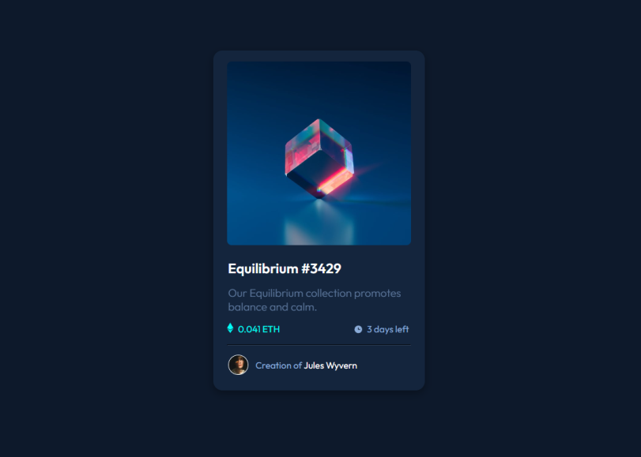

# Frontend Mentor - NFT Preview Card

The second project for [Frontend Mentor](https://www.frontendmentor.io/), was quite fun to make it. Enjoyed alot, learned alot and looking forward to learn further more.

### Live Example

- [Go to Live Example](https://nft-preview-card-frontendmentor-zuhaz.netlify.app/)

### Screenshot

### What I learned

Learned about display: block property,rem size, hover property, made overlay, text-decoration property, transition property, display: flex property, media query, etc.

### Built with

- Semantic HTML5 markup
- Cascading Style Sheet (Css)
- Responsive Design
- Media Query

### Useful resources

- [W3School](https://www.w3schools.com/css) - This helped me with alot of stuff like image hover overlay and stuff.
